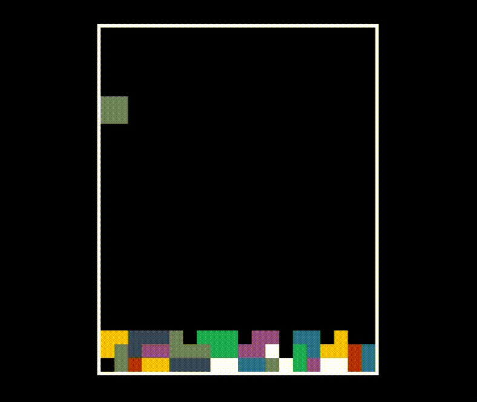

# uefi_tetris

# Build
```
$ git clone https://github.com/eternalinsomnia/uefi_tetris  
$ cd uefi_tetris  
$ make
```
# Launch
## QEMU
```
$ apt install qemu ovmf gnu-efi
$ qemu-system-x86_64 -bios /usr/share/ovmf/OVMF.fd -net none -drive format=raw,file=fat:rw:~/uefi_tetris/  
Shell> fs0:tetris.efi
```
## Create a bootable usb drive
```
$ mkfs.vfat -F32 /dev/sdx
$ mkdir -p mnt
$ mount /dev/sdx mnt/
$ mkdir -p mnt/EFI/BOOT
$ cp tetris.efi mnt/EFI/BOOT/BOOTx64.EFI
$ umount mnt 
```
